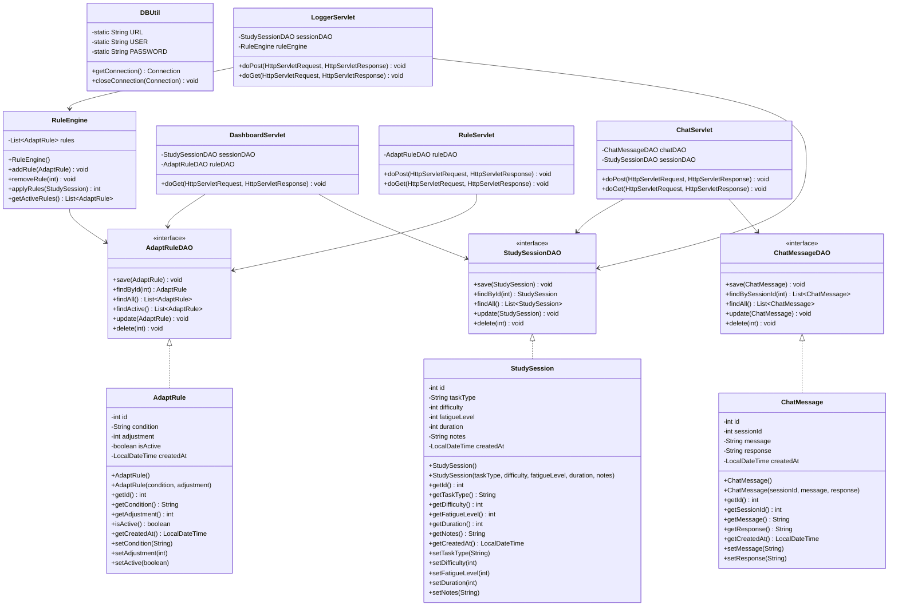

# FocusMind StudyFlow - Class Diagram

## Class Descriptions

### Model Classes

- **StudySession**: Represents a study session with task details and cognitive load metrics
- **AdaptRule**: Defines rules for adapting study sessions based on conditions
- **ChatMessage**: Stores chat interactions related to study sessions

### DAO Interfaces

- **StudySessionDAO**: Data access interface for StudySession entities
- **AdaptRuleDAO**: Data access interface for AdaptRule entities
- **ChatMessageDAO**: Data access interface for ChatMessage entities

### Utility Classes

- **RuleEngine**: Manages and applies adaptation rules to study sessions
- **DBUtil**: Handles database connection management

### Servlet Classes

- **LoggerServlet**: Handles study session logging and rule application
- **DashboardServlet**: Manages dashboard data and statistics
- **RuleServlet**: Handles rule management operations
- **ChatServlet**: Manages chat interactions and AI responses

## Relationships

1. **DAO to Model**: Each DAO interface is implemented for its corresponding model class
2. **Servlet to DAO**: Servlets use DAOs to interact with the database
3. **RuleEngine to DAO**: RuleEngine uses AdaptRuleDAO to access rules
4. **Servlet to RuleEngine**: LoggerServlet uses RuleEngine to apply rules

## Notes

- All model classes include getters and setters for their properties
- DAO interfaces define standard CRUD operations
- Servlets handle HTTP requests and responses
- RuleEngine implements the business logic for rule application
- DBUtil provides centralized database connection management
