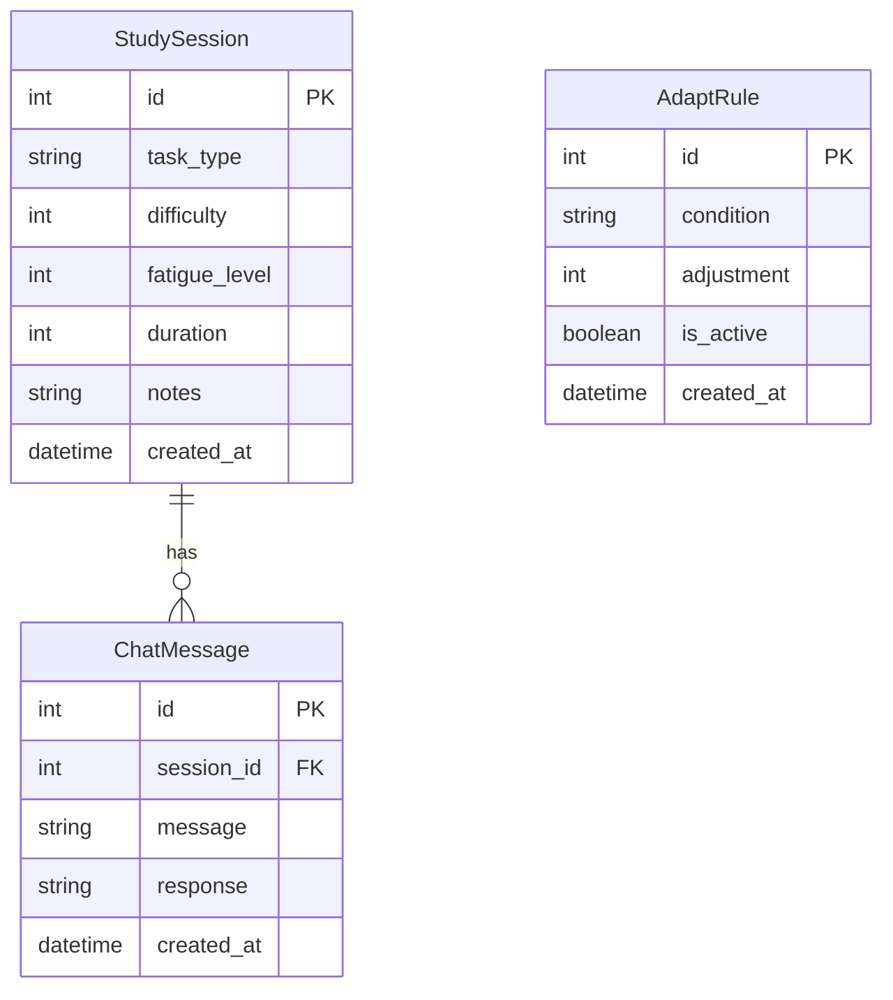

# FocusMind StudyFlow - Entity Relationship Diagram

## Entity Descriptions

### StudySession

- Primary entity for storing study session information
- Contains task details, cognitive load metrics, and duration
- Can have multiple associated chat messages

### AdaptRule

- Stores rules for adapting study sessions
- Defines conditions and adjustments for session duration
- Can be toggled active/inactive

### ChatMessage

- Stores chat interactions related to study sessions
- Links to specific study sessions
- Contains both user messages and AI responses

## Relationships

1. StudySession to ChatMessage: One-to-Many

   - A study session can have multiple chat messages
   - Each chat message belongs to one study session

2. AdaptRule: Independent entity
   - Rules are applied to study sessions based on conditions
   - No direct database relationship, but logical relationship through application logic

## Notes

- All entities include `created_at` timestamp for tracking
- Primary keys are auto-incrementing integers
- Foreign keys maintain referential integrity
- The diagram shows the core entities and their relationships
- Additional metadata and indexes are implemented in the database schema
